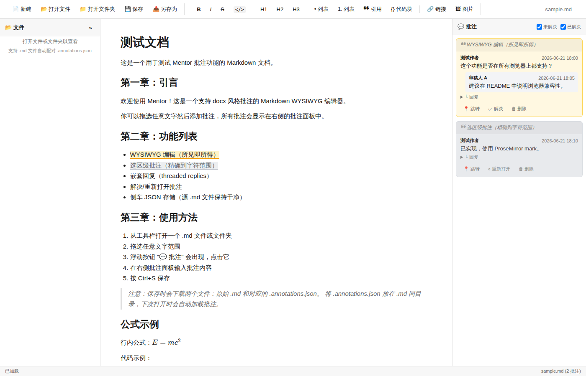

# Mentor

> 像 docx 一样批注 Markdown。

一个 **WYSIWYG Markdown 编辑器**，右侧带 docx 风格批注侧栏，选区级批注、嵌套回复、解决/重新打开、侧车 JSON 存储。**纯前端单页**，无构建步骤，**双击 `index.html` 或起一个静态 server 即可用**。



---

## 特性

- ✅ **WYSIWYG** Markdown 编辑（基于 [Tiptap](https://tiptap.dev/) / ProseMirror）
- ✅ **选区级批注** — 拖选任意范围 → 加批注
- ✅ **嵌套回复**（threaded replies，docx 风格）
- ✅ **解决 / 重新打开** 批注 toggle
- ✅ **侧车 JSON** 存储 — 源 `.md` 文件保持干净
- ✅ **三栏布局** — 文件树 / 编辑器 / 批注面板
- ✅ **键盘快捷键** — `Ctrl+S` 保存，`Ctrl+B/I` 格式化
- ✅ **mark 智能锚定** — 光标落在 resolved mark 内自动 pinned 显示
- ✅ **KaTeX 数学公式** — `$inline$` + `$$block$$`，双向转换 (md → 渲染 → md 源码)
- ✅ **File System Access API** — Chrome/Edge 一键保存到原位置，无需下载
- ✅ **IndexedDB 持久化 handle** — 关闭再开自动重连上次文件夹
- ✅ **零依赖** — CDN ESM，单文件 HTML 即跑

---

## 快速开始

### 方式 1：本地 HTTP server（推荐，自动配对侧车）

```bash
cd Mentor
python3 -m http.server 8765
# 浏览器打开 http://127.0.0.1:8765
```

然后：

1. 点工具栏 **📂 打开文件** → 选你的 .md (Chrome/Edge 可同时选 `my.md` + `my.annotations.json` 自动加载批注)
2. 浏览器会弹出授权提示 → 同意后 Mentor 拿到此文件写权限
3. 之后 `Ctrl+S` **直接写回原文件**，不需要任何下载
4. **下次打开**自动重连上次的 .md 并写回原位置（IndexedDB 记住了 handle）

> **File System Access API** 是 Chrome/Edge 113+ 的能力。一次授权，长期有效。

### 方式 2：双击 `index.html` 直接打开

浏览器直接打开 `file:///.../Mentor/index.html`。基本功能可用，但：
- `📂 打开文件` 走 `<input type="file">` fallback，保存会下载 .md + .annotations.json 两个文件到本地，需手动放回原目录

### 方式 3：Firefox / Safari

不支持 File System Access API。保存时会下载两个文件，需手动放回同目录。

---

## 文件格式

### `.md` (源文件保持干净)

```markdown
# 我的论文

这是正文段落，里面 [可能会] 有批注但不影响 markdown 渲染。
```

保存时批注 mark 完全剥离，不污染源文件。

### `.annotations.json` (侧车)

```json
{
  "version": "1",
  "document": "我的论文.md",
  "updatedAt": "2026-06-21T10:00:00.000Z",
  "author": "张三",
  "annotations": [
    {
      "threadId": "uuid-1",
      "text": "[可能会]",
      "resolved": false,
      "createdAt": "...",
      "comments": [
        {
          "id": "uuid-c1",
          "author": "张三",
          "body": "这里改写一下，'可能会' 太口语。",
          "createdAt": "..."
        },
        {
          "id": "uuid-c2",
          "author": "导师",
          "body": "同意，改成'预期会'更学术。",
          "createdAt": "..."
        }
      ]
    }
  ]
}
```

> **批注位置锚定**：保存的只有 `text` 文本快照。打开文件时，编辑器在文档中查找这段文本的第一个精确匹配，把批注 mark 加回去。如果文档被人为修改导致文本找不到，该批注会标记为 `invalid` 并在侧栏保留数据但不出现在正文中。

---

## 使用技巧

- **拖选任意文字** → 浮动 `💬 批注` 按钮出现 → 点击 → 侧栏新建批注线程
- **光标移到已有批注上** → 侧栏自动 pinned 显示（即使 filter 隐藏）
- **侧栏每个线程**：引用原文、嵌套回复、`📍 跳转` / `✓ 解决` / `🗑 删除`
- **批注过滤**：右侧顶部复选框切换 `未解决` / `已解决`
- **`Ctrl+S`** 保存：下载 `.md` + `.annotations.json`

---

## 架构

```
Mentor/
├── index.html              # 单页面 + ESM importmap
├── styles.css              # 三栏布局 + 批注样式
├── app.js                  # Tiptap 编辑器 + 批注逻辑 + 文件 IO
├── test-data/
│   ├── sample.md                       # 测试 markdown
│   └── sample.md.annotations.json      # 预置批注 (2 线程, 3 评论)
├── tests/
│   └── e2e.spec.js         # Playwright E2E (10 个测试)
└── README.md
```

### 关键技术

| 模块 | 作用 |
|---|---|
| [Tiptap v2](https://tiptap.dev/) | WYSIWYG 编辑器框架 |
| ProseMirror | Tiptap 底层，处理文档树 |
| 自定义 `AnnotationMark` | ProseMirror mark，挂载 `threadId` + `resolved` attrs |
| 自定义 `KatexInline` / `KatexBlock` | ProseMirror atom node，保留 KaTeX HTML 输出 |
| [markdown-it](https://github.com/markdown-it/markdown-it) | MD → HTML (加载) |
| 自定义 math plugin | 处理 `$inline$` / `$$block$$` 公式 |
| [KaTeX](https://katex.org/) | 数学公式排版引擎 |
| [turndown](https://github.com/mixmark-io/turndown) | HTML → MD (保存，自动剥离 mark + 还原公式源码) |
| File System Access API | Chrome/Edge 一键保存到原位置 |
| IndexedDB | 持久化 `FileSystemDirectoryHandle` |
| ESM CDN ([esm.sh](https://esm.sh/)) | 浏览器原生 ES module 加载，无需打包 |

### 关键设计决策

1. **侧车 JSON 而非内嵌**：`xxx.md.annotations.json` 保持源 `.md` 干净，Git diff 友好。
2. **批注位置用 text 锚定**：保存时只存 `text` 文本快照（不是绝对位置），加载时重新查找。重命名/移动文本时位置鲁棒。
3. **mark `inclusive: false`**：新输入的文字不会自动继承批注 mark，避免误标。
4. **pinned 显示**：光标在 mark 内时，即使被 filter 隐藏也强制显示，加蓝色虚线框 + banner 提示。
5. **不支持跨段落批注**：ProseMirror mark 不能跨 block 边界。后续如需要可扩展为多 mark 联动。

---

### 浏览器兼容性

| 浏览器 | File System Access | 公式 | 基础批注 |
|---|---|---|---|
| Chrome / Edge 113+ | ✅ 一键保存 | ✅ KaTeX | ✅ |
| Firefox 110+ | ❌ (下载 fallback) | ✅ KaTeX | ✅ |
| Safari 16+ | ❌ (下载 fallback) | ✅ KaTeX | ✅ |

核心依赖：ES2022 + ES modules + ProseMirror + Tiptap + KaTeX。

> 你的浏览器不支持 FS Access？状态栏会显示提示，保存时自动降级为下载模式。

---

## 已知限制

- ⚠️ 选区不能跨段落（ProseMirror mark 限制）
- ⚠️ 公式编辑：KaTeX node 是 atomic（不可编辑内部），改公式源码需要删除再重输
- ⚠️ Firefox/Safari：保存会下载两个文件，需手动放回 .md 同目录
- ⚠️ 文本被改后批注可能位置失效（标 `invalid` 但不自动重新定位）

## 单 .md 模式说明 (v2)

支持单 .md 模式（无文件夹树）。Chrome/Edge 113+ 选中 .md 后可一授权长期写回原位置；Firefox/Safari 自动下载两个文件。多文件工作请用 OS 文件管理器切换。

### 跨刷新重连

`HandleStore.putFile(name, handle)` 持久化所选 .md 的 FS Access handle，刷新后 `tryReconnect()` 自动校验权限并恢复工作区。Chrome/Edge 在用户不主动撤销时，handle 永久可用。

---

## 开发

### 跑测试

```bash
# 1. 启动 HTTP server
python3 -m http.server 8765 &

# 2. 跑 Playwright E2E
node tests/e2e.spec.js
```

107 个测试覆盖：基础数据流 + UI 按钮 + 快捷键 + 文件 IO 错误处理 + 批注增强 + 公式边界 + UI 状态 + 错误处理 + 单 .md 模式重连 (TEST 106/107)。

### 调试

打开浏览器 DevTools Console，输入 `window.__mdAnnotator`：

```js
__mdAnnotator.State.editor              // 当前 Tiptap editor 实例
__mdAnnotator.State.annotations         // 当前所有批注 thread
__mdAnnotator.State.saveMode            // 'handle' | 'download'
__mdAnnotator.State.currentFile.handle  // FileSystemFileHandle (单 .md 模式, Chrome/Edge)
__mdAnnotator.FS_API.supported          // 浏览器是否支持 File System Access
__mdAnnotator.HandleStore               // IndexedDB handle 持久化工具
__mdAnnotator.HandleStore.putFile(name, handle)  // 持久化单 .md handle
__mdAnnotator.HandleStore.getFile(name)         // 读回 handle
__mdAnnotator.HandleStore.putLastFile(fileName) // 记住最后一次打开的 .md
__mdAnnotator.getEditorHTML()           // 导出 HTML
__mdAnnotator.tryReconnect()            // 手动触发重连
__mdAnnotator.setAuthor('你的名字')      // 设置作者
__mdAnnotator.createTestAnnotation('text')  // 在指定 text 上创建测试批注

// AI 协作协议 (ai-collab-v1)
__mdAnnotator.ai                        // 完整 API 对象
__mdAnnotator.ai.protocol()             // { protocol, author, maxBody, capabilities }
__mdAnnotator.ai.listThreads()          // 列出所有 thread
__mdAnnotator.ai.getThread(threadId)    // 单条 thread 详情
__mdAnnotator.ai.getPending()           // 待回复的 thread 列表
__mdAnnotator.ai.reply(threadId, body)  // AI 回复（返回 { ok, comment?, error? }）
__mdAnnotator.ai.onNewComment(cb)       // 订阅新评论事件
__mdAnnotator.ai.onThreadChange(cb)     // 订阅 thread 变更事件
```

---

## AI 协作协议 (`ai-collab-v1`)

Mentor 提供结构化 API 让 AI 作为"协作审阅者"参与——**不通过模拟点击 UI**，而是通过协议直接读写批注数据。

**核心保证**：
- ✅ AI 能 **读** 所有 thread、评论、文档信息
- ✅ AI 能 **写** 回复（带 author 标识）
- ✅ AI 能 **订阅** 新评论/thread 变更事件
- ❌ AI **不能** createThread / delete / resolve（API 不暴露）
- ❌ AI **不能** 修改别人的评论

### API

```js
const ai = window.__mdAnnotator.ai;

// 读
ai.protocol();          // → { protocol: 'ai-collab-v1', author: 'AI Reviewer', maxBody: 5000, capabilities: {...} }
ai.getDocInfo();        // → { fileName, annotationCount, pendingCount, saveMode, author }
ai.listThreads();       // → [{ threadId, text, resolved, commentCount, lastComment, needsReply }, ...]
ai.getThread(id);       // → { threadId, text, resolved, comments: [...] } | null
ai.getPending();        // → [threads where needsReply === true]

// 订阅
const unsub = ai.onNewComment(({ threadId, comment }) => {
  // 新评论时触发
});
const unsub2 = ai.onThreadChange(({ threadId, change }) => {
  // change: 'create' | 'reply' | 'delete' | 'resolved'
});

// 写（只能 reply）
const result = ai.reply(threadId, '回复内容');
// → { ok: true, comment: { id, author: 'AI Reviewer', body, createdAt } }
// → { ok: false, error: 'threadId 必须为非空字符串' }
// → { ok: false, error: 'body 不能为空' }
// → { ok: false, error: 'body 超过最大长度 5000' }
// → { ok: false, error: 'thread 不存在: xxx' }
// → { ok: false, error: 'thread 已 resolved，无法回复' }
```

### Capabilities

| 操作 | AI 能做 | 备注 |
|---|---|---|
| `listThreads` | ✅ | 读所有 thread |
| `getThread` | ✅ | 读单条 |
| `getPending` | ✅ | 读待回复 |
| `onNewComment` / `onThreadChange` | ✅ | 订阅事件 |
| `reply` | ✅ | 写回复（带 AI Reviewer 标识） |
| `createThread` | ❌ | API 不暴露（不污染人工审阅流） |
| `deleteThread` | ❌ | API 不暴露（不能删除人的批注） |
| `resolve` | ❌ | API 不暴露（resolved 由用户决定） |

### 演示

```bash
# 1. 启动服务
cd /mnt/e/hermes_playground/Mentor
python3 -m http.server 8765 &

# 2. 浏览器打开 http://localhost:8765
# 3. 加载任意 .md + 加几个批注

# 4. 在 DevTools Console 跑：
const ai = window.__mdAnnotator.ai;
ai.protocol();           // 看协议元信息
const pending = ai.getPending();  // 找待回复的
pending.forEach(t => {
  ai.reply(t.threadId, '🤖 AI 建议：...');  // 回复
});
```

完整演示脚本：`/tmp/ai-collab-v2-demo.js`

---

## 路线图 (后续)

- [ ] 公式源码编辑（双击 KaTeX node 弹出源码编辑框）
- [ ] 批注导出 PDF（带批注边距，模拟 docx 打印）
- [ ] 协作：批注 @ 提及、状态 (open/in-progress/resolved)
- [ ] 多选区批注合并 / 拆分
- [ ] 主题切换（深色模式）
- [ ] 文件监视 — 文件被外部修改时提示重载

## 已完成 (v1.x)

### M15 — Status bar 实时更新 (docx 一致)

- Status bar 加载时显示文件名 + 字数 + 行数 + 批注数
- 编辑后实时刷新（debounced 250ms via updateDocMeta）
- 实现：`app.js` `updateDocMeta()` 函数 + 4 处 hook（加载/创建批注/编辑 transaction/解决批注）
- 测试：TEST 104 (加载时) + TEST 105 (实时更新) in `e2e.spec.js`

### P3-A — Mark active class 持久化 (P3-A 回归保护)

- 点击 mark → 该 mark 标 is-active class，其他取消
- Schema attr `active` 同步到 PM state，刷新不丢
- 实现：`app.js` `highlightActiveMark()` 双 pass（先清后设）+ `setupAnnotationMarkClickObserver()` mousedown 拦截
- 关键 fix：removeMark/addMark 不能在同 descendants callback 内连续做，会位置错位
- 关键 fix：mousedown 时主动 setTextSelection + focus 触发 onSelectionUpdate
- 测试：`e2e-p3a-active-mark.spec.js` 全 56 个 test

### P-multi-para — 多段批注 status 提示

- 跨段落选区 → 创建多段批注 → status-left 显示 "已创建多段批注" (单段保持 "已创建批注")
- 修复 pre-existing baseline: e2e-multi-paragraph 5/6 → 6/6
- 测试：`e2e-multi-paragraph.spec.js`

### 平台兼容

- e2e tests 在 WSL + Windows git-bash 都能跑（detectRoot 自动检测）
- 修过的 WSL hardcoded path 文件：`e2e.spec.js`, `e2e-p3a-active-mark.spec.js`, `e2e-long.spec.js`

---

## 许可

MIT — 自由使用、修改、分发。